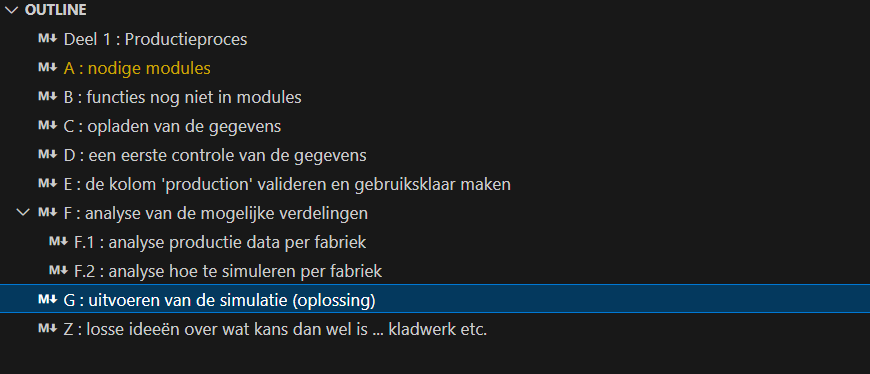

# 1. production  
de code base bevat  
- "Modelling a production process" en  
- "Analyze 2nd hand Volvo's"  

# 2. wat is dit ?  
Deze codebase 'production' maakt deel uit van de studentopdrachten voor de Syntra cursus 'Data scientist', gegeven door Tim Hellemans. Deze codebase is de 2de gequoteerde studentenopdracht om het deel statistiek en grafieken te oefenen.

# 3. wat is de opdracht ?  

De opdracht bestaat uit 2 onafhankelijke delen namelijk  

- modelleren en simuleren van een productieproces : productiemodel  
zie oplossingen in notebook in de map  /notebooks/productiemodel.ipynb  
alle data zit in map /data/raw/productiemodel  

- het analyseren van verkoopsgegevens van 2dehands volvo's : autoproductie  
zie notebook in de map /notebooks/autoproductie.ipynb  
alle data zit in map /data/raw/autoproductie  

- de beschrijving en het gevraagde van de opdrachten kan teruggevonden worden  
in de folder /documentation in de pdf file evaluatie_statistiek.pdf

# 4. uitvoeren : hoe weet ik snel wat het allemaal doet ?  
doe een run all, nadat je de omgeving hebt opgezet  

- voor notebook 'productiemodel.ipynb'  
    - ga na uitvoering 'run all'
    direct naar sectie "G : uitvoeren van de simulatie (oplossing)"  
    en voer de cell uit met de functie mdls.simulatie(..) 
    als je de verschillende waarden voor de fabrieken BRU en STO 
    wil testen 
    - secties A t.e.m. E laden en manipuleren de data
    - sectie F analyseert de productie gegevens en onderzoekt de simulatie
    - in sectie G : zet de 2 lijnen met 'BRU','STO','ALL' actief of in commentaar voor resultaten relatief aan de fabriek  
    en voer de cel opnieuw uit, pas variabele 'use_random_seed' aan voor variabiliteit in de simulatie
    - outline opdracht 'productiemodel.ipynb'  
    

- voor notebook 'autoproductie.ipynb'  
    - ga na uitvoering 'run all'  
    direct naar sectie "F : vragen en antwoorden "
    - secie F bevat telkens een paragraaf met de (herhaalde) vraag 
    en het bijbehorende antwoord (in kleur Cadetblue) in een aparte cell          
    - per vraag zie je onder het antwoord ook een aparte paragraaf 'Onderzoek' met de  
    (onderzoeks)code geschreven om het antwoord te kunnen formuleren  
    - sectie A t.e.m E bevat het laden en manipuleren de data
    - outline opdracht 'autoproductie.ipynb'  
    

- tips  
    - gebruik de outline functie van VS code om snel naar het deel te gaan van je interesse  
    - voor data analyse voor beide opdrachten werd de Microsoft Data Wrangler extension gebruikt  

# 5. omgeving : opzetten van de omgeving  
opgezet als .venv in VS code Python 3.12.3  
zie requirements.txt  

# 6. eigen modules in /scripts 
- /scripts/come_in_handy as cih
    - cih.show_info_about_column(..)  
    = in één keer de nodige gegevens zien van één enkele kolom  

- /scripts/model_data_loaders as mdll
    - mdll.laad_msr_gegevens_in_dataframe(..)  
    = opladen van basis MSR gegevens per fabriek  
    - mdll.laad_dagelijkse_productie_in_dataframe(..)  
    = opladen van alle JSON dag files per fabriek   

- /scripts/model_simulatie as mdls
    - mdls.simulatie(..)  
    = verwerkt en simuleert het gevraagde
    zie ook mdls.simulatie? voor input en output  

- /scripts/verkoop_bereken_CI as vkCI 
    - vbCI.bereken_confidence_interval(..)  
    = berekent confidence interval voor een dataframe en bijbehorende column
    = gebruikt in vraag 7
    zie ook vbCI.bereken_confidence_interval? voor input en output  

- /scripts/bereken_percentiel_voor_rang as vpp
    - vpp.bereken_percentiel_voor_rang(..)
    = berekent in welk precentiel de gerankte waarde valt
    = gebruikt in vraag 2
    zie ook vpp.bereken_percentiel_voor_rang? voor input en output  

- /scripts/my_constants.py 
    - bevat constanten die mogelijk hebruikbaar zijn, zoals bv. kleuren  
    opgezet na tip van Tim tijdens de les, wordt voorlopig nog niet gebruikt  

- /scripts/my_matplotlib_standards.py as mypltstd  
    - mypltstd.my_matplotlib_pyplot_standards_setup(..)
    opgezet na tip van Tim tijdens de les  
    voor grafische plot constanten en default setting  

